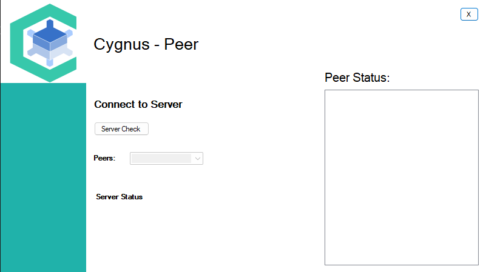
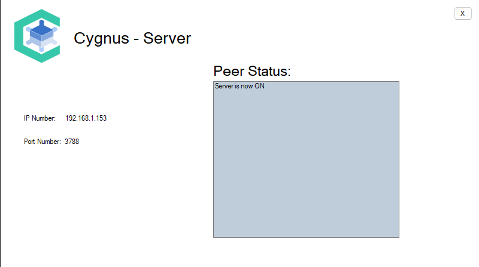

# ProjectCygnus_PeertoPeerFileSharing
Sharing bulk of files locally by establishing connection with server first.

## Pre-Requisities
* Visual Studio - IDE
* C# - Language

## **Setup**
* Clone the repository on to the dirctory.
* Start server application before peers to establish connection
* Create two peers to connect to same server.
* Select file and push through the server.

### **Screenshot**

